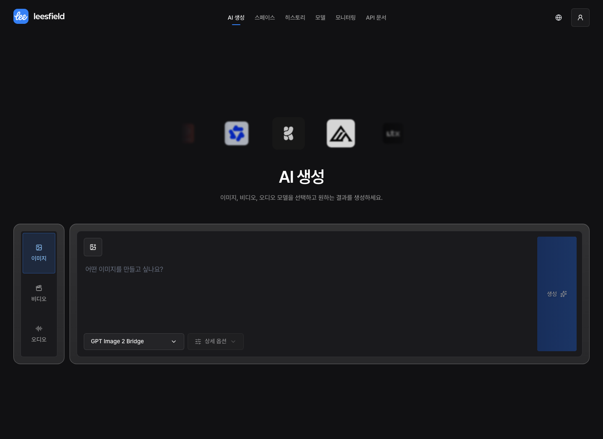

<p align="center"></p>

<h1 align="center"><strong>Leesfield</strong></h1>

<p align="center"><strong>다양한 AI 생성 모델을 하나의 인터페이스에서 실행하고 관리하는 AI inference platform</strong></p>

<p align="center">
  <a href="LICENSE"></a>
  
  
  
</p>

<p align="center">
  <a href="#quick-start">Quick Start</a> •
  <a href="#주요-기능">주요 기능</a> •
  <a href="#시스템-구성">시스템 구성</a> •
  <a href="#실행과-배포">실행과 배포</a> •
  <a href="https://leesfield.leey00nsu.com/api-docs">API 문서</a> •
  <a href="https://leesfield.leey00nsu.com">데모</a>
</p>

<p align="center"></p>
<p align="center"></p>

---

## Quick Start

```bash
# 저장소 복제 및 의존성 설치
git clone https://github.com/leey00nsu/leesfield.git
cd leesfield
pnpm install --frozen-lockfile

# 환경변수 준비: 실행 전에 인증·저장소·제공업체 설정을 채웁니다
cp .env.example .env

# PostgreSQL 및 스키마 준비
docker compose up -d
pnpm db:prepare

# 개발 서버 실행
pnpm dev
```

[http://localhost:3000](http://localhost:3000)에서 확인합니다. 관리자 비밀번호 해시는 `pnpm gen:admin-password-hash`로 생성합니다. 필요한 설정은 [.env.example](.env.example)에 정리되어 있습니다.

## 주요 기능

### AI 생성

- 이미지·비디오·오디오를 하나의 화면에서 생성
- 모델별 입력과 상세 옵션 제공
- 생성 결과 재생·다운로드와 히스토리 검색
- 이전 결과와 입력을 재사용해 다시 생성

### 스페이스

- 프롬프트·미디어 입력, 생성과 편집 노드를 연결하는 캔버스
- 같은 입력을 여러 모델에 연결해 결과 비교
- 노드별 실행과 결과 보관
- 스페이스 만들기·복사·삭제 및 자동 저장
- 그룹, 댓글, 프리셋과 이미지 분할 편집

### 모델 카탈로그

- 모델별 제공업체, 입력 파라미터, 기본값과 검증 규칙 관리
- 공개 Gradio API를 제공하는 Hugging Face Space의 모델 설정 가져오기
- 모델 활성화와 기본 모델 지정
- 모델별 동시 실행 수 제어

### 운영 모니터링

- 비동기 생성 작업의 상태와 소요 시간 조회
- 요청량, 실패율과 모델 사용 현황 확인
- 모델·상태·API 키별 작업 필터

### 외부 API

- API 키 발급과 폐기
- 모델 목록과 모델별 입력 스키마 조회
- 이미지·비디오·오디오 통합 생성 요청 및 작업 상태·결과 조회
- 공통 API 계약으로 생성되는 OpenAPI 문서

한국어와 영어 UI를 지원합니다.

## 기술 스택

| 영역 | 기술 |
| --- | --- |
| Framework | Next.js 16 App Router, React 19 |
| Language | TypeScript 5.9 |
| UI | Tailwind CSS 4, Base UI, shadcn, Motion |
| Server state | TanStack Query |
| Forms | React Hook Form, Zod |
| Canvas | Node Banana, React Flow |
| Charts | Recharts |
| Database | PostgreSQL, Prisma 6 |
| Authentication | iron-session |
| Media storage | Leemage |
| Test | Vitest, Playwright, Storybook |

## 시스템 구성

```text
웹 생성 / 스페이스 / 외부 API
  └─ Next.js
      ├─ 모델 카탈로그 ── 입력 검증·제공업체 설정
      ├─ 비동기 생성 작업 ── 모델별 동시성 제어
      │   └─ Provider adapter ── Hugging Face / Codex
      ├─ 미디어 저장 ── Leemage
      └─ PostgreSQL ── 카탈로그·작업·히스토리·스페이스
```

모델 카탈로그는 제공업체별 API와 입력 파라미터를 관리합니다. 웹과 외부 API는 이 설정을 바탕으로 입력을 검증하고 비동기 작업을 실행합니다. 클라이언트는 작업 ID로 상태와 결과를 조회합니다. 새로운 제공업체를 연결하려면 서버 어댑터 구현이 필요합니다.

스페이스의 캔버스는 고정된 Node Banana 원본에 Leesfield 패치를 적용해 사용합니다. 생성 실행과 미디어 저장은 Leesfield 서버에서 처리합니다. 원본과 패치 관리 방법은 [런타임 안내](third_party/node-banana/README.md)를 참고하세요.

## 실행과 배포

### 사전 요구사항

- Node.js 22와 pnpm
- PostgreSQL 및 로컬 DB 실행용 Docker
- 시스템 `patch` 명령
- 사용하는 AI 제공업체의 인증 설정
- 결과 저장을 위한 Leemage 프로젝트와 API 키

### 인증과 저장소

관리자 인증과 세션 설정은 [.env.example](.env.example)을 따릅니다. 개발용 로그인 우회는 `.env.local`의 `DEV_AUTH_BYPASS=true`로 설정할 수 있으며 개발 모드에서만 동작합니다.

Leemage 연결에는 `LEEMAGE_API_KEY`와 `LEEMAGE_PROJECT_ID`가 필요합니다. 스페이스에서 생성·편집 결과를 보관하려면 저장소를 설정해야 합니다.

### 제공업체 설정

이미지는 `hf_space`, `codex_cli`, `codex_bridge`, 비디오와 오디오는 `hf_space` 어댑터를 지원합니다. 모델별 설정은 관리 화면에서 등록합니다. 상세 입력 규칙은 [모델 카탈로그 가이드](MODEL_CATALOG.md)를 참고하세요.

`codex_bridge`는 별도 이미지 생성 서비스에 연결합니다. 앱에는 `CODEX_IMAGE_BRIDGE_URL`과 `CODEX_IMAGE_BRIDGE_TOKEN`을 설정하며, Codex CLI는 해당 서비스에서 실행합니다.

### 운영 실행

```bash
pnpm install --frozen-lockfile
pnpm build
pnpm start
```

빌드 전에 캔버스 런타임과 Prisma Client를 생성합니다. 시작 시 인증 설정을 확인하고 DB 마이그레이션을 적용합니다. 운영 DB의 기존 데이터를 확인하고 배포 전에 백업을 준비하세요.

Coolify/Nixpacks에서는 빌드 환경에 `NIXPACKS_APT_PKGS=patch`를 설정해야 합니다. JavaScript 의존성 설치만으로 시스템 `patch`가 설치되지는 않습니다.

### 주요 화면

| 경로 | 화면 |
| --- | --- |
| / | 랜딩 |
| /generate | AI 생성 |
| /history | 생성 히스토리 |
| /spaces | 스페이스 목록 |
| /model | 모델 카탈로그 |
| /monitoring | 운영 모니터링 |
| /api-key | API 키 관리 |
| /api-docs | API 문서 |

## API 문서

[웹 API 문서](https://leesfield.leey00nsu.com/api-docs)와 `/api/openapi`에서 공통 API 계약을 확인할 수 있습니다. 실제 등록 모델과 모델별 입력은 API 키로 인증한 뒤 조회합니다.

| 메서드 | 경로 | 용도 |
| --- | --- | --- |
| GET | /api/external/models | 활성 모델 조회 |
| GET | /api/external/models/{modelId}/schema | 모델별 입력 스키마 조회 |
| POST | /api/external/generations | 생성 작업 요청 |
| GET | /api/external/generations/{requestId} | 작업 상태·결과 조회 |

외부 API에는 `X-API-Key` 헤더가 필요합니다. 생성 요청은 `type`, `model`, `dynamicParams`를 사용하며 프롬프트·크기·시드 등 실제 입력 이름은 모델 스키마를 따릅니다. 작업 조회는 요청한 API 키의 작업으로 제한됩니다.

## 프로젝트 구조

```text
src/
├── app/          Next.js 라우트
├── screens/      페이지 구성
├── widgets/      독립적인 UI 블록
├── features/     사용자 기능
├── entities/     도메인 모델과 UI
├── shared/       공통 설정·유틸리티·UI
└── server/       서버 실행·인증·저장소
prisma/           DB 스키마와 마이그레이션
scripts/          개발·검증 스크립트
third_party/      고정 외부 원본·패치·라이선스
```

## 테스트

```bash
pnpm test
pnpm typecheck
pnpm lint
pnpm build

# 원본·패치 재현성, import, 라이선스 및 취약점 검사
pnpm vendor:node-banana:verify

# 스페이스 브라우저 테스트와 컴포넌트 개발
pnpm e2e:node-studio
pnpm storybook
```

## 관련 문서

- [환경변수 설정](.env.example)
- [모델 카탈로그](MODEL_CATALOG.md)
- [공통 UI 출처](COPY_SINGER_UI.md)
- [Node Banana 런타임](third_party/node-banana/README.md)
- [서드파티 고지](third_party/node-banana/THIRD_PARTY_NOTICES.md)

## 라이선스

[MIT License](LICENSE). 포함된 외부 코드에는 각 프로젝트의 라이선스와 고지가 적용됩니다.
