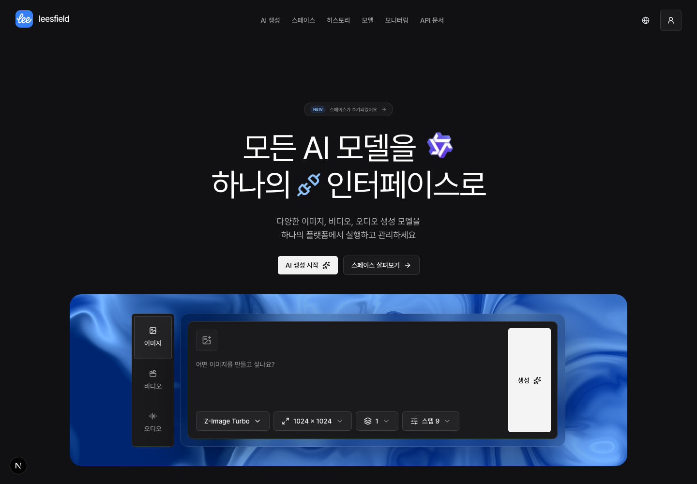
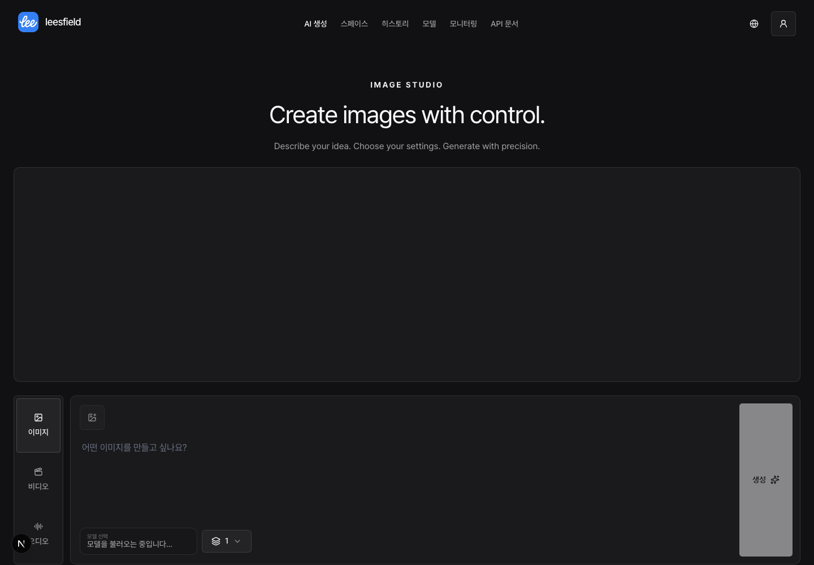

<p align="center">
  
</p>

<h1 align="center">
  <strong>leesfield</strong>
</h1>

<p align="center">
  <strong>AI inference platform</strong>
</p>

<p align="center">
  <a href="LICENSE"></a>
  
  
</p>

<p align="center">
  <a href="#quick-start">Quick Start</a> •
  <a href="#주요-기능">주요 기능</a> •
  <a href="#api-문서">API 문서</a> •
  <a href="https://leesfield.leey00nsu.com">데모</a>
</p>

---

## 목차

- [Quick Start](#quick-start)
- [스크린샷](#스크린샷)
- [주요 기능](#주요-기능)
- [기술 스택](#기술-스택)
- [설치 및 설정](#설치-및-설정)
- [API 문서](#api-문서)
- [프로젝트 구조](#프로젝트-구조)
- [테스트](#테스트)
- [문제 해결](#문제-해결)
- [문서](#문서)

## 플랫폼 개요

Leesfield는 서로 다른 AI inference provider의 API와 파라미터를 **runtime model catalog**로 추상화하고, **모델별 동시성 제어·비동기 job orchestration·API key 기반 외부 API·운영 모니터링**을 제공하는 AI inference platform입니다.

모델별 provider와 입력·기본값·검증 규칙은 카탈로그에서 관리합니다. 웹 UI와 외부 API에서 요청을 받아 비동기 작업을 실행하고 상태와 결과를 조회합니다. 새로운 provider 연동에는 서버 adapter 구현이 필요하며, 매체별 외부 API를 하나의 HTTP endpoint로 합치는 구조는 아닙니다.

`모델 선택 / 입력 검증 → 비동기 job → 모델별 동시성 제어 → provider adapter → 결과·히스토리 / 모니터링`

- **웹 생성**: `/generate?type=image|video|audio`에서 매체와 모델을 선택합니다. 탭 전환 시 세션 내 초안과 진행 중 job을 유지합니다. 기존 `/image`, `/video`, `/audio` 링크는 입력 query를 보존해 통합 화면으로 연결합니다.
- **카탈로그**: 모델별 API·파라미터 설정과 기본 모델을 관리합니다. [모델 카탈로그 가이드](MODEL_CATALOG.md)를 참고하세요.
- **실행과 운영**: 비동기 job 상태 조회, 모델별 동시성 설정, 요청량·성공률·지연 시간·모델 사용 현황을 제공합니다.
- **외부 API**: `x-api-key` 인증으로 이미지·비디오·오디오 생성과 상태 조회, 모델 조회 API를 사용합니다.
- **Spaces**: 노드로 입력과 결과를 구성하고 개별 노드를 직접 실행합니다. 일반 생성과 같은 서버 실행 기반을 사용합니다.

## Quick Start

```bash
# 1. 저장소 복제 및 설치
git clone <repository_url> && cd leesfield-fe
pnpm install

# 2. 환경 변수 설정
cp .env.example .env

# 3. 데이터베이스 준비
docker compose up -d
pnpm db:prepare

# 4. 개발 서버 실행
pnpm dev
```

## 스크린샷

### 랜딩 페이지



### 이미지 생성 페이지



## 주요 기능

### 🎨 AI 생성

- 이미지·비디오·오디오 통합 생성 화면과 매체별 입력·결과
- 생성·편집 asset 히스토리 조회 및 재사용

### ◈ Spaces

- image·audio·video 입력, 생성, 기본 편집과 출력을 typed Graph로 구성
- 교체 가능한 Canvas runtime과 Leesfield Graph·Generation·MediaAsset adapter 경계
- 사용자가 선택한 단일 Node 실행, durable output과 SSE/polling 상태 복구
- `/spaces` 목록에서 만들기·열기·복사·삭제하고 상세 편집기에서 서버 자동 저장
- Node Banana 기반 canonical Graph v3, 일반 그룹·댓글·사용자별 모델 기본값, 시스템 clipboard/drop과 단축키
- Prompt Constructor의 변수 조합, 새 Space에 적용하는 6개 Quickstart 프리셋과 튜토리얼
- Split Grid 셀별 미니 캔버스: 템플릿 편집·Apply·Undo·재적용 확인, 셀마다 독립된 노드·연결·그룹 저장

### 📊 모델 관리

- runtime model catalog 등록/수정과 모델별 파라미터·provider 설정
- 모델별 동시성 제어와 비동기 job 실행·상태 조회
- 모니터링 대시보드

### 🔗 API 통합

- RESTful API 및 자동 생성 OpenAPI 문서
- API 키 기반 인증

### 🌐 국제화 (i18n)

- next-intl 기반 다국어 지원 (한국어, 영어)

## 브랜드 UI

Copy Singer의 고정 shadcn/Base UI 원본을 재사용하며, 차콜 다크 테마·오프화이트 주요 버튼·블루 브랜드 강조·Pretendard를 적용합니다. 출처와 최소 통합 차이는 [COPY_SINGER_UI.md](COPY_SINGER_UI.md)에서 추적합니다. Spaces도 같은 장기 디자인 시스템의 대상이며 실제 스타일 전환은 후속 적용합니다.

## 기술 스택

| 영역           | 기술                    |
| -------------- | ----------------------- |
| **Framework**  | Next.js 16 (App Router) |
| **Language**   | TypeScript              |
| **Styling**    | Tailwind CSS, shadcn/ui |
| **State**      | TanStack Query          |
| **Form**       | React Hook Form         |
| **Validation** | Zod                     |
| **Database**   | PostgreSQL, Prisma      |
| **Auth**       | iron-session            |
| **Test**       | Vitest                  |
| **DevOps**     | Docker, Husky, pnpm     |

## 설치 및 설정

### 사전 요구사항

- Node.js `>=20.9.0`
- pnpm
- Docker (PostgreSQL)

### 1) 환경 변수

`.env.example`을 복사하여 `.env` 파일을 생성하세요:

```bash
cp .env.example .env
```

각 변수에 대한 상세 설명과 설정 방법은 [.env.example](.env.example) 파일을 참고하세요.

### 비밀번호 해시 생성

```bash
pnpm gen:admin-password-hash
```

출력된 값은 base64url 형태이므로 그대로 `.env`에 넣으면 됩니다.

### 로컬 개발 로그인 우회

UI를 빠르게 확인할 때 `.env.local`에 아래 값을 추가하면 로그인 화면 없이
관리자 세션으로 접근할 수 있습니다.

```dotenv
DEV_AUTH_BYPASS=true
```

우회 계정은 `DEV_AUTH_BYPASS_EMAIL`, `ADMIN_EMAIL`, `dev@localhost` 순서로
결정됩니다. 이 기능은 `NODE_ENV=development`에서만 동작하며 운영 환경에서는
플래그가 설정되어 있어도 비활성화됩니다.

### 2) 로컬 DB 실행 (PostgreSQL)

```bash
docker compose up -d
```

### 3) 개발 서버 실행

```bash
pnpm dev
```

### 4) 이미지/비디오/오디오 저장 어댑터

현재 지원 어댑터:

- `leemage` (기본값)

설정:

- `IMAGE_STORAGE_PROVIDER`로 저장 어댑터를 선택합니다.
- `VIDEO_STORAGE_PROVIDER`, `AUDIO_STORAGE_PROVIDER`도 동일하게 저장 어댑터를 선택합니다.
- `leemage`를 사용하는 경우 `LEEMAGE_API_KEY`, `LEEMAGE_PROJECT_ID`가 필수입니다.
- 이미지/비디오에서 저장소 설정이 없거나 지원되지 않는 경우: 결과는 즉시 응답되지만 히스토리(DB) 저장은 생략됩니다.
- 오디오에서 저장소 설정이 없거나 지원되지 않는 경우: 외부 저장소 업로드를 건너뛰고 inline 결과를 DB에 저장합니다.

Node Studio의 생성·편집 output은 Graph 새로고침과 History 재사용을 보장해야 하므로 세 media 모두 `leemage` durable storage가 필요합니다. Classic 생성 화면의 기존 fallback 정책은 그대로 유지되지만, Node 실행은 storage가 준비되지 않으면 명시적으로 중단됩니다.

### 5) Node Studio runtime과 vendored Node Banana

Node Banana는 npm dependency나 별도 fork가 아니라 `third_party/node-banana/`의 고정 upstream snapshot과 Leesfield patch stack으로 포함됩니다. 생성된 work copy는 버전 관리하지 않으며 `dev`, `test`, `build`, Storybook 전에 로컬 snapshot만으로 재생성됩니다.

```bash
# snapshot hash 확인, patch 적용, generated runtime 준비
pnpm vendor:node-banana:prepare

# offline 재현성, import deny-list, license, 취약점 baseline, SBOM 검증
pnpm vendor:node-banana:verify

# SBOM을 의도적으로 갱신할 때
pnpm sbom:generate
```

- F059의 초기 cutover와 Spaces 전환 migration은 당시 기존 테스트 Graph를 제거하는 breaking change였습니다. 그 이후 생성된 Spaces는 보존하며 v3 전환은 additive migration과 지원되는 v2 config의 읽기 변환을 사용합니다. migration을 다시 적용하기 위해 Graph를 수동으로 비우지 않습니다.
- Graph와 분리 가능한 Image/Video/Audio Generation, MediaOperation, MediaAsset, History는 `ON DELETE SET NULL` 관계로 보존됩니다. 운영 적용 전 DB snapshot을 확보하고, 장애 복구는 downgrade가 아닌 snapshot 복원 또는 forward fix로 수행합니다.
- 런타임 선택·canary 환경변수는 없습니다. Spaces의 유일한 Canvas와 writer는 Node Banana adapter를 거친 canonical v3입니다. 알 수 없는 Node/config version은 원문을 보존하는 읽기 전용 상태로 표시합니다.
- 지원하는 원본 Node는 20종입니다. LLM·Array·Router·Switch·Conditional Switch·Comfy App·3D 생성/뷰어, AI workflow 작성, 전체/선택 workflow 자동 실행은 제외합니다. 비용 추정·JSON 교환·영구 snapshot은 후속 범위이며 Audio Edit는 제거됐습니다.
- 프리셋과 셀 템플릿 Apply는 생성 API를 호출하지 않습니다. 사용자가 catalog 모델과 입력을 설정하고 노드를 직접 실행합니다. 샘플 이미지 자동 배포와 browser provider key 설정은 제공하지 않습니다.
- `edit.image.removeBackground`는 별도 browser/provider 설정을 저장하지 않습니다. 활성 `hf_space` 이미지 모델의 ModelCatalog `meta.operations.background_removal` capability가 있을 때만 palette에 노출되고, 실행은 Leesfield의 server credential·공통 execution/storage adapter를 통과합니다.
- license 원문·third-party notice·upstream pin은 `third_party/node-banana/`에, production SBOM은 `third_party/node-banana/sbom.cdx.json`에 있습니다.

### 6) 어댑터 구현 방식

이 프로젝트는 **API 호출(생성)**과 **저장소 업로드**를 각각 어댑터 패턴으로 분리했습니다.

#### 1) API 호출 어댑터 (이미지/비디오/오디오 생성)

현재 구현된 provider:

- 이미지: `hf_space`, `codex_cli`, `codex_bridge`
- 비디오: `hf_space`
- 오디오: `hf_space`

설정/선택:

- 각 모델의 `provider`가 실제 어댑터 선택에 사용됩니다.
- 모델 정의는 DB의 모델 카탈로그에서 관리합니다.

추가 방법:

1. 어댑터 파일 추가
   - 이미지: `src/server/image-generation/adapters/`
   - 비디오: `src/server/video-generation/adapters/`
   - 오디오: `src/server/audio-generation/adapters/`
2. `types.ts`의 인터페이스 구현
3. `image-generation.ts` / `video-generation.ts` / `audio-generation.ts`에서 제공자 분기 추가
4. 모델 카탈로그(DB) 갱신
5. 필요 시 `.env.example`에 새 제공자 설정 추가

`codex_bridge` provider는 별도 `codex-image-bridge` 서비스가 Codex CLI/OAuth를 소유하는 운영 구성을 위한 provider입니다. leesfield 앱에는 `CODEX_IMAGE_BRIDGE_URL`과 `CODEX_IMAGE_BRIDGE_TOKEN`만 설정하면 되고, 메인 앱 컨테이너에 `codex` CLI를 설치할 필요가 없습니다. `CODEX_IMAGE_BRIDGE_URL`은 path 없는 `http(s)` origin/root URL이어야 하며, 앱은 `/v1/images/jobs`로 job을 만든 뒤 `/v1/images/jobs/{jobId}`를 polling합니다.

#### 2) 저장소 어댑터 (이미지/비디오/오디오 업로드)

기본 제공자:

- 이미지 저장: `leemage`

설정/선택:

- 이미지: `IMAGE_STORAGE_PROVIDER`로 선택합니다. (기본: `leemage`)
- 비디오: `VIDEO_STORAGE_PROVIDER`로 선택합니다. (기본: `leemage`)
- 오디오: `AUDIO_STORAGE_PROVIDER`로 선택합니다. (기본: `leemage`)
- `leemage` 사용 시 `LEEMAGE_API_KEY`, `LEEMAGE_PROJECT_ID`가 필수입니다.
- Leemage 업로드/삭제 클라이언트는 공식 npm 패키지 `leemage-sdk`를 사용합니다.
- 과거 내부 경로(`src/shared/lib/leemage-sdk`)는 제거되었으며, 현재 런타임에서는 사용하지 않습니다.
- 이미지/비디오는 설정이 없거나 지원되지 않으면 **결과는 응답되지만 히스토리(DB) 저장은 생략**됩니다.
- 오디오는 설정이 없거나 지원되지 않으면 **외부 저장소 업로드를 건너뛰고 inline 결과를 히스토리(DB)에 저장**합니다.

추가 방법:

1. 저장 어댑터 구현 추가
   - 이미지: `src/server/image-generation/storage/adapters/`
   - 비디오: `src/server/video-generation/storage/adapters/`
   - 오디오: `src/server/audio-generation/storage/adapters/`
2. `storage-adapter.ts` 인터페이스 구현
3. `storage-selector.ts`에 선택 규칙 추가
4. 필요 시 `.env.example`에 새 저장소 설정 추가

### 7) 모델 카탈로그 관리

모델 정의/파라미터는 DB의 모델 카탈로그에서 JSON 구조로 저장됩니다.
관리 화면에서 등록/수정한 설정이 생성 요청과 검증에 사용됩니다.

자세한 스키마 정보: [모델 카탈로그 가이드](MODEL_CATALOG.md)

### 8) 이미지 생성 저장 구조

이미지 생성 요청은 핵심 컬럼(예: prompt/steps/size)과 함께 `requestParams` JSON 컬럼에도 저장됩니다.
모델별 파라미터가 달라져도 히스토리를 보존하기 위한 목적입니다.

## API 문서

### 인증

- **외부 API 인증**: `x-api-key` 헤더 사용

### OpenAPI

- **웹 UI**: `/api-docs`
- **JSON**: `/api/openapi`

### 외부 API 사용

모델별 `provider` 값에 따라 API 호출 어댑터가 선택됩니다.
현재 이미지 호출 어댑터는 `hf_space`, `codex_cli`, `codex_bridge`이며, provider별 설정은 모델 카탈로그(DB)에서 관리합니다. `codex_bridge` token 값은 DB가 아니라 env로만 읽습니다.

외부 API 엔드포인트:

- `POST /api/external/image-generation`
- `GET /api/external/image-generation/{requestId}`
- `POST /api/external/video-generation`
- `GET /api/external/video-generation/{requestId}`
- `POST /api/external/audio-generation`
- `GET /api/external/audio-generation/{requestId}`
- `GET /api/external/models`

## 프로젝트 구조

**Feature-Sliced Design (FSD)** 아키텍처를 따릅니다.

```
src/
├── app/              # Next.js App Router (라우팅 전용)
├── screens/          # 페이지 컴포넌트
├── widgets/          # 독립적인 UI 블록
├── features/         # 비즈니스 기능 단위
├── entities/         # 비즈니스 엔티티
├── shared/           # 공용 유틸리티/컴포넌트
└── server/           # 서버 전용 코드
```

의존성 규칙: `app` → `screens` → `widgets` → `features` → `entities` → `shared`

## 개발 스크립트

```bash
pnpm build
pnpm start
pnpm lint
pnpm typecheck
```

## 테스트

```bash
# 테스트 실행
pnpm test

# 워치 모드
pnpm test:watch
```

## 문제 해결

<details>
<summary><strong>데이터베이스 연결 오류</strong></summary>

```bash
docker compose ps      # 상태 확인
docker compose restart postgres  # 재시작
```

</details>

<details>
<summary><strong>세션/인증 오류</strong></summary>

- `SESSION_PASSWORD`가 32자 이상인지 확인
- `.env.example` 설정 참조

</details>

<details>
<summary><strong>저장소 연결 실패</strong></summary>

- `LEEMAGE_API_KEY`, `LEEMAGE_PROJECT_ID` 설정 확인
- Leemage 서비스 상태 확인

</details>

## 문서

- 스펙/계획/태스크: `../docs/features/`
- 디자인 레퍼런스: `../docs/designs/`
- 제품 요구사항: `../docs/prd/lees_field_prd.md`
- 시스템 아키텍처: `../docs/prd/system-architecture.md`

## 라이선스

[MIT License](LICENSE)

랜딩에서는 스페이스와 같은 React Flow 엔진의 4노드 캔버스로 로컬 예제를 조작할 수 있습니다. 예제 변경은 저장되지 않으며 생성 API를 호출하지 않습니다. 랜딩은 Copy Singer BentoGrid와 Aceternity UI의 Layout Text Flip·무음 Terminal을 사용하며 출처와 통합 차이는 COPY_SINGER_UI.md에서 확인할 수 있습니다.
